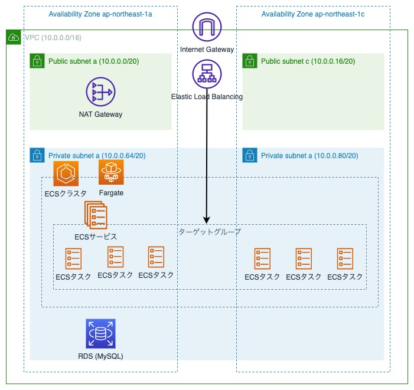

# Venus

インフラ勉強用のリポジトリ。

バックエンドはRails、インフラ構築はterrafrom、CI/CDにはGithubActionsを使用する。

terraformを使用することで、Sandbox環境の作成/削除を何度も行いながら検証できるようになっている。

アプリケーションは、つぶやき(tweet)のREST APIのみのシンプルなものを用意した。

```
$ ENDPOINT=$(
  aws elbv2 describe-load-balancers --names venus-sandbox-backend | \
  jq -r ".LoadBalancers[0].DNSName"
)

$ curl http://${ENDPOINT}/tweets
# => []

$ curl http://${ENDPOINT}/tweets -X POST -H 'Content-Type: application/json' -d '{ "message": "test1" }'
# => {"id":1,"message":"test1","created_at":"2023-01-07T01:06:59.352800+00:00","updated_at":"2023-01-07T01:06:59.352800+00:00"}

$ curl http://${ENDPOINT}/tweets
# => [{"id":1,"message":"test1","created_at":"2023-01-07T01:06:59.352800+00:00","updated_at":"2023-01-07T01:06:59.352800+00:00"}]

$ curl http://${ENDPOINT}/tweets/1 -X DELETE -H 'Content-Type: application/json'
# => {"status":"ok","message":"deleted"}

$ curl http://${ENDPOINT}/tweets
# => []
```

**NOTE**

リポジトリ名に特に意味はない。星の名前を普段から使っているだけ。

**重要**

Sandbox環境を立ち上げた場合、1時間あたり約0.2ドルのお金がかかります。

内容やサンプルに基づくいかなる運用結果に関しても一切の責任を負いません。

## 環境構築

最低限必要なものは下記のみ。
- AWSアカウント
- 管理者権限を持つユーザとそのアクセスキー

アクセスキーは`.env`ファイルに下記のように記載しておくか、`aws-vault`経由でdocker-composeを起動すること。

```
AWS_REGION=ap-northeast-1
AWS_ACCESS_KEY_ID=example
AWS_SECRET_ACCESS_KEY=example
```

terraformで外部から渡す変数は環境変数として渡すため、`.env`ファイルに下記のように記載する。
```
# GithubActionsでAWSへアクセスするGithubリポジトリ名
TF_VAR_github_repository_name=akito-fujisaki/venus
```

x86-64/x64アーキテクチャのCPU環境の場合は、`.env`ファイルに下記を追記する。
arm64の場合は何もしなくてよい。

```
AWS_CLI_URL=https://awscli.amazonaws.com/awscli-exe-linux-x86_64.zip
AWS_CLI_SSM_URL=https://s3.amazonaws.com/session-manager-downloads/plugin/latest/ubuntu_64bit/session-manager-plugin.deb
TERRAFORM_URL=https://releases.hashicorp.com/terraform/1.3.6/terraform_1.3.6_linux_amd64.zip
```

## Sandbox環境の作成手順

### 1. AWSリソースの作成

#### 1.1 作業用のinfraコンテナに入る

```
$ docker-compose run --rm infra bash
```

下記がホスト上にインストール済みであればdocker上で実行しなくても問題ない

- aws-cli
- aws-cliのssmプラグイン
- terraform

#### 1.2 commonディレクトリで環境共通のリソースを作成する

```
$ cd /terraform/common
$ terraform init
$ terraform plan
$ terraform apply
```

#### 1.3 sandboxディレクトリでSandbox環境のAWSリソースを作成する

※ RDSの作成に5~7分ほどの時間がかかる。

```
$ cd /terraform/sandbox
$ terraform init
$ terraform plan
$ terraform apply
```

### 2. Sandbox環境のセットアップ

#### 2.1 GithubActions経由でデプロイする

infraコンテナではなく、ホスト上のプロジェクトルートで実行する。

**main以外では実行できないため、必ずmainブランチに移動すること**

```
$ cmd/deploy sandbox

# 下記のように出力されるため、確認待ちになったら`Y`を入力する
Tag: sandbox-20230107093052
Push tag? (Y/n):
```

mainブランチの最新コミットに`sandbox`から始まるタグを付け、pushするコマンド。

このイベントをトリガーとして、GithubActionsでデプロイを行うようにしてある。
詳しくは`.github/workflows/deploy-sandbox.yml`と`.github/actions/deploy/action.yml`を参照。

**NOTE**

terraformでECSサービスまでを作成するようにしているが、ダミーのタスク定義を登録した上で必要タスク数を「0」としている。

そのため、ここではタスク定義の登録だけ行われる。

#### 2.2 Railsアプリ用のデータベースを作成し、マイグレーションを実行する

infraコンテナではなく、ホスト上のプロジェクトルートで実行する。

```
$ cmd/ecs-run-backend sandbox rails db:create db:migrate
```

`2.1`で登録したECSタスク定義を元にタスクを実行するコマンド。
実行できているかどうかはCLIかAWSコンソールで確認すること。

#### 2.3 ECSサービスの必要タスクを増やす

terraformでECSサービスまでを作成するようにしているが、ダミーのタスク定義を登録した上で必要タスク数を「0」としている。

Railsタスクを起動できる準備が整ったため、必要タスク数を増やす。

```
$ docker-compose run --rm infra aws ecs update-service \
  --cluster venus-sandbox-backend --service api --desired-count 1
```

### 4. 動作確認

#### 4.1 infraコンテナに入る

```
$ docker-compose run --rm infra bash
```

#### 4.2 ロードバランサのDNS名を変数に入れておく

```
$ ENDPOINT=$(
  aws elbv2 describe-load-balancers --names venus-sandbox-backend | \
  jq -r ".LoadBalancers[0].DNSName"
)
```

#### 4.3 curlでtweetsのREST APIを叩く

```
$ curl http://${ENDPOINT}/tweets
# => []

$ curl http://${ENDPOINT}/tweets -X POST -H 'Content-Type: application/json' -d '{ "message": "test1" }'
# => {"id":1,"message":"test1","created_at":"2023-01-07T01:06:59.352800+00:00","updated_at":"2023-01-07T01:06:59.352800+00:00"}

$ curl http://${ENDPOINT}/tweets
# => [{"id":1,"message":"test1","created_at":"2023-01-07T01:06:59.352800+00:00","updated_at":"2023-01-07T01:06:59.352800+00:00"}]

$ curl http://${ENDPOINT}/tweets/1 -X DELETE -H 'Content-Type: application/json'
# => {"status":"ok","message":"deleted"}

$ curl http://${ENDPOINT}/tweets
# => []
```

### 5. AWSリソースの削除

#### 5.1 infraコンテナに入る

```
$ docker-compose run --rm infra bash
```

#### 1.2 sandboxディレクトリでSandbox環境のAWSリソースを削除する

※ RDSの削除に5~7分ほどの時間がかかる。

```
$ cd /terraform/sandbox
$ terraform init
$ terraform plan -destroy
$ terraform destroy
``` 

#### 1.3 commonディレクトリで環境共通のリソースを削除する

```
$ cd /terraform/common
$ terraform init
$ terraform plan -destroy
$ terraform destroy
```

## Sandbox環境のインフラ構成図



## Tips

### ECSタスクを単体で実行

下記はマイグレーションを実行する例
```
# cmd/ecs-run-backend <環境名> <コマンド>
$ cmd/ecs-run-backend sandbox rails db:migrate
```

### ECSタスクコンテナへ入る

下記は`sandbox`用のECSタスクに入る例
```
# cmd/ecs-exec-backend <環境名> <コマンド>
$ cmd/ecs-exec-backend sandbox bash
```
